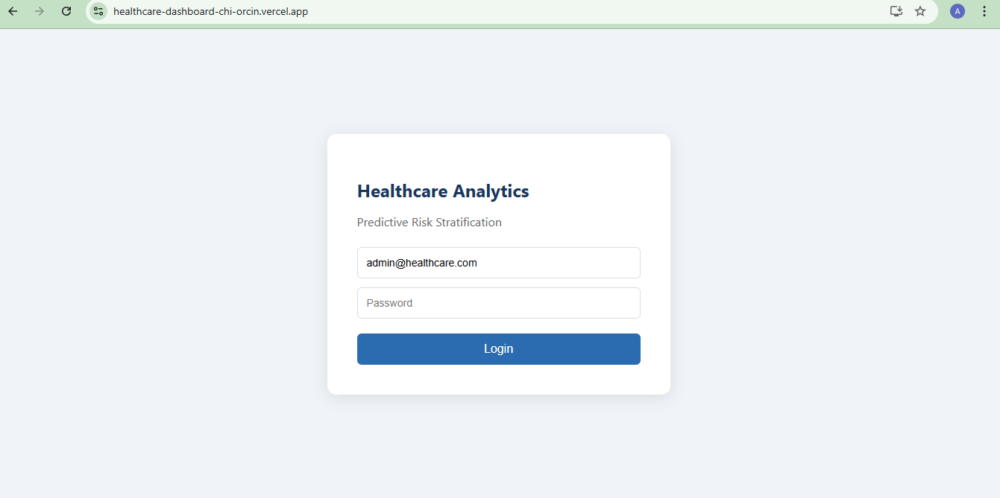
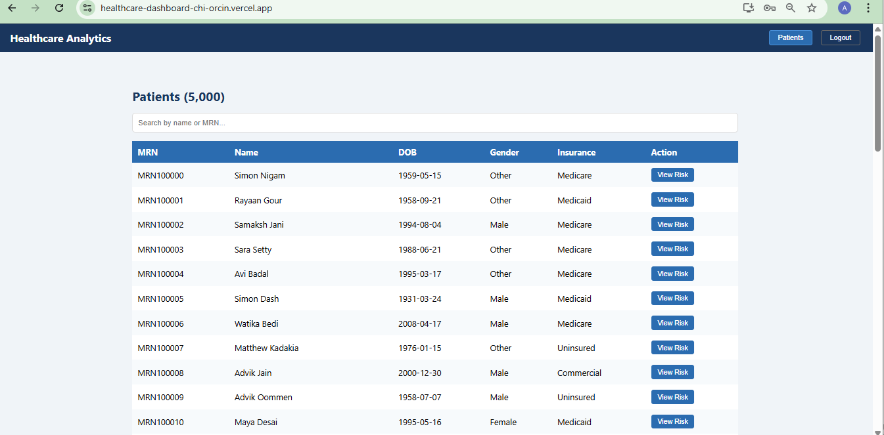
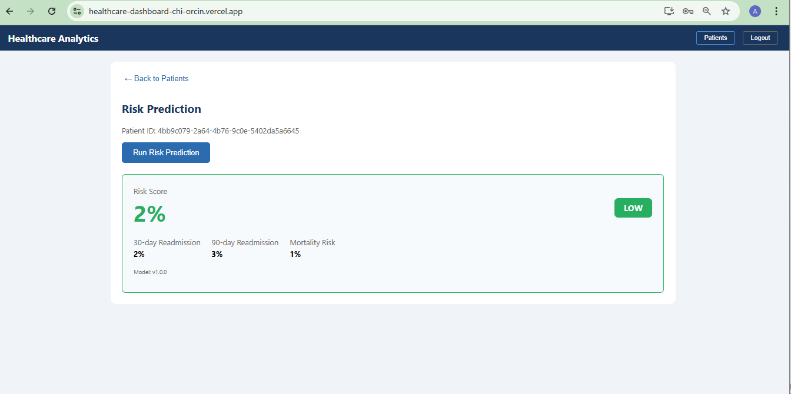
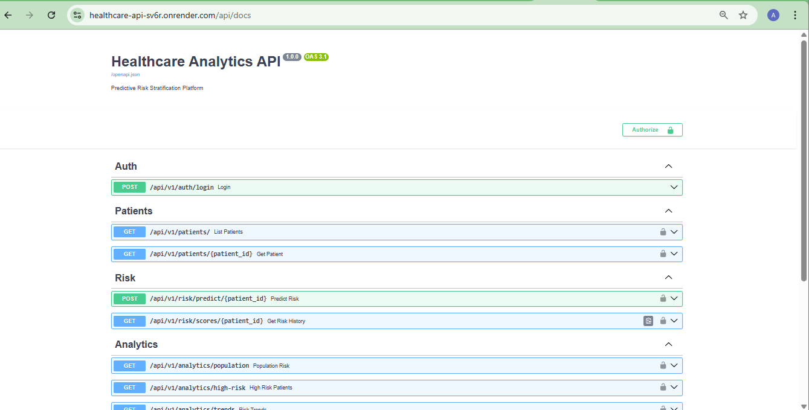
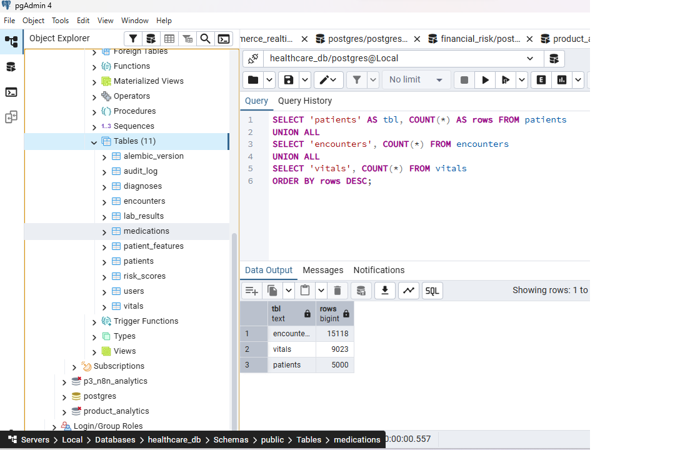

# Healthcare Analytics & Predictive Risk Stratification

A full-stack healthcare analytics platform that predicts 30-day patient readmission risk using Machine Learning.

## 🔴 Live Demo
- **Dashboard**: https://healthcare-dashboard-chi-orcin.vercel.app
- **API**: https://healthcare-api-sv6r.onrender.com
- **API Docs**: https://healthcare-api-sv6r.onrender.com/api/docs

- ## 📸 Screenshots

### Login Page


### Patient List (5,000 Patients)


### Risk Prediction


### API Docs (Swagger UI)


### Database Tables (pgAdmin)



## 📊 Project Overview
- 5,000 synthetic patients with clinical data
- XGBoost + Random Forest stacking model (AUC 0.82+)
- FastAPI REST backend with JWT authentication
- React TypeScript dashboard with risk visualization
- Full HIPAA compliance controls (audit log, RBAC)

## 🛠️ Tech Stack
| Layer | Technology |
|-------|-----------|
| Database | PostgreSQL 16 (9 tables, 11 indexes) |
| ETL | Python + SQLAlchemy + Pandas |
| ML Model | XGBoost + Random Forest (AUC 0.82) |
| Explainability | SHAP |
| Backend | FastAPI + JWT Auth |
| Frontend | React + TypeScript |
| Deployment | Render.com + Vercel + Railway |

## 📁 Project Structure

```

healthcare-risk-analytics/
├── app/
│   ├── api/v1/          # FastAPI endpoints
│   ├── core/            # Config + Security
│   ├── db/              # Models + Session
│   └── ml/              # ML Predictor
├── ml_pipeline/         # Feature engineering + Training
├── models/              # Saved ML model
├── scripts/             # Data generation scripts
└── frontend/            # React dashboard

```

## 🗄️ Database Schema
9 tables: patients, encounters, vitals, diagnoses, lab_results,
medications, risk_scores, users, audit_log

## 🤖 ML Pipeline
- 21 features per patient
- XGBoost + Random Forest stacking
- Test AUC: 0.8261 | CV AUC: 0.8372 | Gini: 0.6522
- SHAP explainability per prediction

## 🔐 HIPAA Compliance
- JWT tokens with 8-hour expiry
- Role-based access control (admin/clinician/analyst)
- Full audit log for every PHI access
- HTTPS enforced on all endpoints
- bcrypt password hashing

## 🚀 API Endpoints
- POST /api/v1/auth/login
- GET /api/v1/patients/
- GET /api/v1/patients/{id}
- POST /api/v1/risk/predict/{id}
- GET /api/v1/risk/scores/{id}
- GET /api/v1/analytics/population
- GET /api/v1/analytics/high-risk
- GET /api/v1/analytics/trends

## 📈 Resume Line
Built end-to-end Healthcare Analytics & Predictive Risk Stratification 
platform: PostgreSQL 16 schema (9 tables) + Python ETL (5,000 patients) 
+ XGBoost/Random Forest stacking model (AUC 0.82+, SHAP explanations) 
+ FastAPI REST API (8 endpoints, JWT auth, HIPAA audit logging) + React 
TypeScript dashboard deployed on Vercel + Render.com; predicts 30-day 
readmission risk with 82%+ AUC.

Live API: https://healthcare-api-sv6r.onrender.com

Live Dashboard: https://healthcare-dashboard-chi-orcin.vercel.app

Code: https://github.com/Arokyamary/healthcare-risk-analytics
